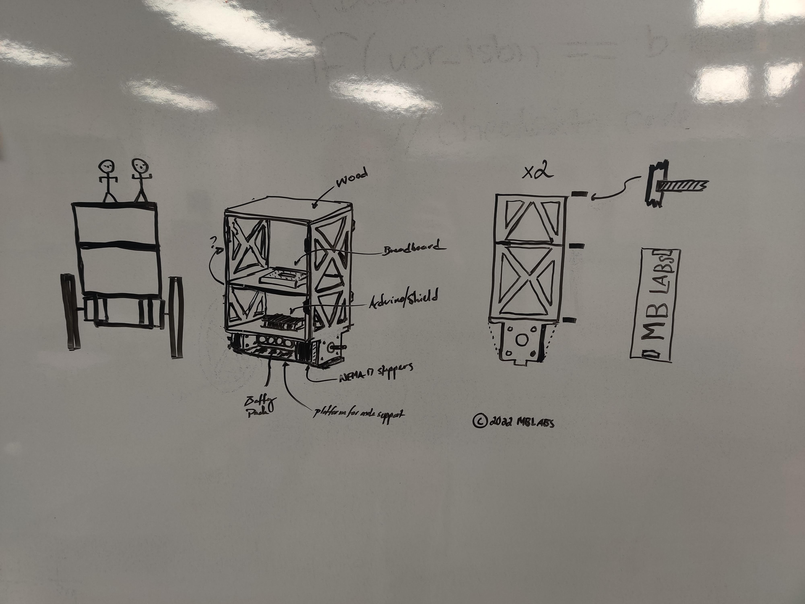
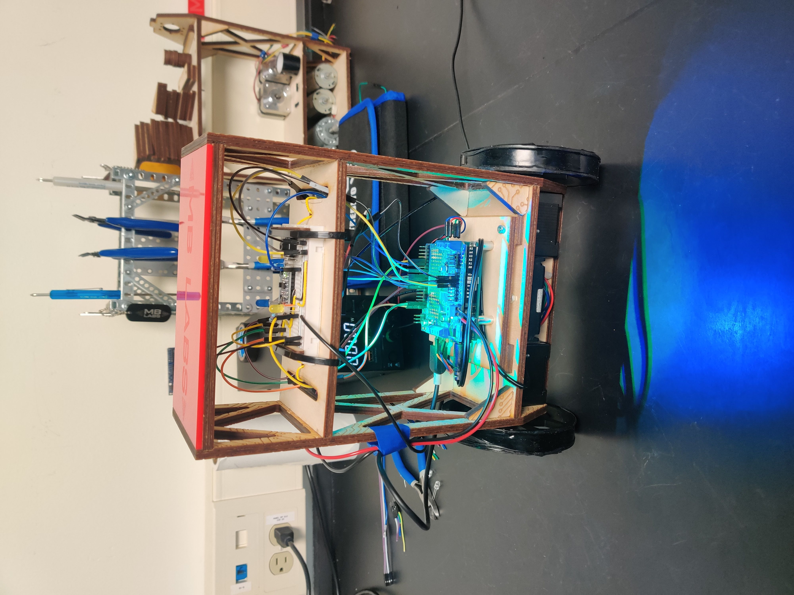

# Lab8 - Final Project (Self-Leveling Robot)
Michael Sell (Lab partner: Ben Schaser)

## Table of Contents:

[`Resources`](#resources)

[`Materials`](#materials)

[`Objective`](#objectiveproposal)

[`3D Printing/Laser Cutting`](#3d-printinglaser-cutting)

[`Robot Design`](#robot-design)

[`Robot Assembly`](#robot-assembly)

[`Code`](#code)

* [PID Control](#pid-control)

[`Troubleshooting`](#troubleshooting)

[`Performance`](#performance)


## Resources
#
* [Self-Levling Bot Instructional](https://www.instructables.com/Arduino-Self-Balancing-Robot-1/)
* [Self-Leveling Bot w/ Video](https://electricdiylab.com/diy-self-balancing-robot/)
* [MotorShield Instruction](https://learn.adafruit.com/adafruit-motor-shield-v2-for-arduino/using-stepper-motors)
* [Potential Wheel Option](https://www.amazon.com/90-10mm-Black-Robot-Wheels/dp/B00T3MQG7M/ref=sr_1_33?crid=D4G5H5ZWXL8G&keywords=Plastic+Robotic+Wheel+Rubber+Tire+Wheel+100m&qid=1667595648&qu=eyJxc2MiOiIwLjk3IiwicXNhIjoiMC4wMCIsInFzcCI6IjAuMDAifQ%3D%3D&sprefix=plastic+robotic+wheel+rubber+tire+wheel+100m%2Caps%2C231&sr=8-33)
* [Accelstepper](https://github.com/adafruit/AccelStepper/blob/master/AccelStepper.cpp)
* [DC Motor that would probably work](https://www.studica.com/612rpm-6-12v-planetary-gearmotor)
* [Adafruit Motorshield Libray V_2](https://github.com/adafruit/Adafruit_Motor_Shield_V2_Library)


## Materials
#
* `Arduino UNO`

* `2 NEMA 17 Stepper Motors (42mm High Torque Hybrid Stepping Motor)`
    * [WEBPAGE for initial motors](https://www.adafruit.com/product/324)
    * [DataSheet][def]
    * [WEBPAGE for secondary motors](https://www.amazon.com/STEPPERONLINE-Stepper-Bipolar-Connector-compatible/dp/B00PNEQKC0/ref=pd_lpo_1?pd_rd_w=VVyFf&content-id=amzn1.sym.116f529c-aa4d-4763-b2b6-4d614ec7dc00&pf_rd_p=116f529c-aa4d-4763-b2b6-4d614ec7dc00&pf_rd_r=Q3J30165BRB4FEZH3M7K&pd_rd_wg=fr7PN&pd_rd_r=af540885-be9c-4284-956a-336d7fa965b7&pd_rd_i=B00PNEQKC0&psc=1)

[def]: motordatasheet.jpeg

* `Adafruit Motorshield Kit`
    * [LINK TO WEBPAGE](https://www.adafruit.com/product/1438)
    * <a href="https://cdn-shop.adafruit.com/datasheets/TB6612FNG_datasheet_en_20121101.pdf">View DataSheet</a> 
    
* `Gyroscope Module`
    * [LINK TO WEBPAGE](https://www.amazon.com/HiLetgo-MPU-6050-Accelerometer-Gyroscope-Converter/dp/B00LP25V1A/ref=sr_1_1?crid=32FG5TYBEF8PB&keywords=MPU-6050%2BModule%2B3%2BAxis%2BGyroscope%2B%2B%2B3%2BAxis%2BAccelerometer%2FG-Sensor%2C%2BI2%2B%C2%B0C%2C%2Be.g.%2Bgenuino%2Bfor%2BArduino%2C%2BRaspberry%2BPi&qid=1664679029&qu=eyJxc2MiOiIwLjcyIiwicXNhIjoiMC4wMCIsInFzcCI6IjAuMDAifQ%3D%3D&sprefix=mpu-6050%2Bmodule%2B3%2Baxis%2Bgyroscope%2B%2B%2B3%2Baxis%2Baccelerometer%2Fg-sensor%2C%2Bi2%2Bc%2C%2Be.g.%2Bgenuino%2Bfor%2Barduino%2C%2Braspberry%2Bpi%2Caps%2C68&sr=8-1&th=1)
    * Main Chip: MPU-6050
    * Power supply: 3~5V
    * Communication mode: standard IIC communication protocol
    * Chip built-in 16bit AD converter, 16bit data output
    * Gyroscopes range: +/- 250 500 1000 2000 degree/sec
    * Acceleration range: ±2 ±4 ±8 ±16g 

* `Batteries`
    * In our case: 8 AA 1.5V rechargeable batteries (TENERGY Premium 2500mAh Ni-MH Rechargeable)

* `Breadboard/wires`

* `Wheels/Tires`
    * Anything around 10cm diameter wheels should suffice. Preferably a good amount of grip for the the bot to maintain traction with various surfaces. In our case, we will be 3D Printing the wheel rims and using rubber tape to wrap around the rims for our "tires".
    * [STL FILE](wheel-rims.stl)

* `Hardware`
    * Various screws, nuts, etc. that we have yet to determine
    * Brackets for stepper motor installation
    * 4 support beams for structural integrity

* `Structure`
    * Platforms for UNO, battery, and anything else to rest on while offering the bot support. (3 in total, in our case, we will be cutting them out of a 1/4" piece of wood with a laser cutter)


## Objective/Proposal
#
Create a robot using an Arduino Uno and the above listed materials that is able to autonomously level itself without any human interaction after the bot is turned on.

`Steps to Completion:` We will be designing the robot similar to other bots listed under the [resources](#resources) section. We will be using all the components listed above with miscellaneous hardware in order to accomplish this. As for the software, we will be using a PID controller in order to control our robot. This will depend on our robot structure and the exact dimensions. We will be 3D printing the wheel rims and using the laser cutter in order to cut our platform sectionals. 

## Testing Components
#

We started by testing the stepper motors and followed the online instructions on the webpage for the motor shield. We soldered the shield and the gyroscope.

<p align="left">

<align="right">

<align="center">

</p>

We had to make sure the .h files (all the required libraries) were also in the arduino folder.

After putting the motors and the new wheels on our robot frame, we found that the motors were not making us very happy. For one, they didn't seem to be able to go fast enough. They produced very little torque and they were very jerky in motion as we have to step each one at a time instead of running them simultaneously. To remedy this, we went from the initial stepper motors and moved to our secondary stepper motors. These were rated for 2A instead of 350mA and supposedly had a higher torque at around .5NM. There is a calculation based on the weight and height of your robot to calculate how much torque is necessary for motors but we didn't do that because we were lazy. Also there weren't that many options for stepper motors so we just picked the one that could deliver the most torque without being too big. 


## 3D Printing/Laser Cutting
#

`Laser Cut thickness for red line: .072pt, Red line`

Our first test of the 3D print for the wheel rims didn't turn out very well as it printed out vertical instead of horizontal. To make it better, we switched it so that it was lying horizontal on the base plate and switched from non-soluble support material to water-soluble material so that we would end up with a cleaner product. We ended up re-printing a third time and this time opted for some larger wheels to fit our bigger robot design. 


<!--  -->
Above is the image of our laser cut components for our new design.

## Robot Design
#

Platform Dimensions: 3.5 x 7 x 1/4" (x3) (Perhaps?)
(9cm x 18cm)
8.4 cm x 16 cm

For general robot design, we started out with a rough prototype version involving a decomissioned erector set as seen below. This Mark1 was very heavy in nature due to the amount of metal used. It was also quite tall and we soon realized that we would have to look at other methods for constructing a better robot with a better weight distribution. We had thought that more weight on the top would make it easier to balance the robot, and while this may be true in theory, it ended up making the entire robot too heavy and the motors ended up not being able to move it.

<p align="left">

<align="right">

</p>

Eventually, after a few days of adjusting parameters and trying different methods, we concluded the new stepper motors were still not fast enough and were not stepping in sync, causing the bot to shake violently, twist, and fall over. We then went to Dr. Kuehns laboratory and got two of his DC Planetary Gearbox motors. One of the motors he had was great with an integrated gearbox of 612RPM. This had enough speed and plenty of torque for our purposes. Unfortunately, the other gearbox was set at 60RPM and so we were unable to use them simultaneously. We purchased two more pairs of DC motors from American Science and Surplus but we quickly discovered that there was not enough torque being generated by either kind. 

We ended up completely rethinking our design as we kept running into the problem of our robot falling over too fast and the motors not having enough torque/speed to recover. We hoped that creating a chassis out of wood while making it smaller would aid in this problem. 


<p align="center">

</p>

<p align="center">

</p>

## Robot Assembly
#

`Note - Black M3 screws used to hold motors in brackets are Professor Brewsters! (Now the silver M3 screws*)`

Bonding agent used: Locktite Professional Performance Spray Adhesive (Obtained from Dr. Kuehn)


<p align="center">

</p>

<p align="center">

</p>

After lasercutting a completely new design to accomodate our DC motors, we went back to our secondary frame and resorted to using the stepper motors. Our final design was quite good with a solid structural integrity and pleasing asthetic:

<p align="center">

</p>
<p align="center">

</p>

(Yes we added RGB lights and a speaker)

## Code
#

For the software, we used the instructional resources above as a rough guide of what to do. We started by using the accelerometer along with the ```atan2(x,y)``` function in order to get an angle from the acceleration. We then gathered the data from the gyroscope. The angle from the acceleration is very consistent but has to deal with gravity and acceleration in other directions while the gyroscope module has some float or accumulated error. Both of these methods have certain drawbacks, so, in order to remedy this, we applied both through a complementary filter. This allowed us to modify our output to optimize the accuracy and stability of our output angle. 


When adjusting PID parameters, we increased `Kd` until the robot just barely overshot itself when trying to correct and then turned it down slightly to just before that threshold. Secondly, we adjusted `Ki` to apply a damping of motion to the equation so that our robot would correct with out overshooting. We finally adjusted the `Ki` parameter but found that this value seemed to be detrimental to the functionality of our stepper motors and so we kept this value << 1

With adjusting the PID control, we found it was much easier to adjust the PID parameters using potentiometers in real-time instead of guessing a value and uploading the code hundreds of times. We used a simple 10k Ohm pot to tun ours. 

<details>
<summary> 
<font size="5">Early Iteration of Code </font>
</Summary>
<br>
<font size="1">

```C++
// Michael Sell and Ben Schaser
// Full code (early version):

#include <Wire.h>
#include <Adafruit_MPU6050.h>
#include <Adafruit_Sensor.h>
#include <Adafruit_MotorShield.h>
#include "utility/Adafruit_MS_PWMServoDriver.h"

Adafruit_MPU6050 mpu;
Adafruit_MotorShield AFMS = Adafruit_MotorShield();
Adafruit_StepperMotor *leftMotor = AFMS.getStepper(600, 2);
Adafruit_StepperMotor *rightMotor = AFMS.getStepper(600, 1);

// Angle of Inclination
double accX, accZ;
double accAngle;
int gyroY, gyroRate;
double gyroAngle = 0;
double gyroAngleNext = 0;
double gyroAnglePrev = 0;
unsigned long currTime, prevTime = 0;
double loopTime;
double currentAngle = 0;
double prevAngle = 0;
double prevPrevAngle = 0;
double nextAngle = 0;
double tau = 0.7;
double dt = 0.004;
double alpha = tau / (tau + dt);

// PID Constants
double Kp = 0.0;
double Ki = 0.0;
double Kd = 0.0;

double targetAngle = 0;
double difference = 0;
double prevDif = 0;
double difSum = 0;
double motorSpeed = 0;
double RtoD = 57.2957795131;

void setup() {
  Serial.begin(9600);
  mpu.begin();

  // set accelerometer range to +-8G
  mpu.setAccelerometerRange(MPU6050_RANGE_8_G);

  // set gyro range to +- 500 deg/s
  mpu.setGyroRange(MPU6050_RANGE_500_DEG);

  // set filter bandwidth to 21 Hz
  mpu.setFilterBandwidth(MPU6050_BAND_21_HZ);

  //  mpu.setXAccelOffset(315);
  //  mpu.setYAccelOffset(993);
  //  mpu.setZAccelOffset(415);
  //  mpu.setXGyroOffset(93);
  //  mpu.setYGyroOffset(-23);
  //  mpu.setZGyroOffset(-11);

  AFMS.begin();
  TWBR = ((F_CPU/400000l) - 16)/2; // Change the i2c clock speed to 400KHz
}

void loop() {
  currTime = millis();
  //  Serial.println(currTime - prevTime);
  loopTime = (currTime - prevTime);
  loopTime = loopTime / 1000;
  prevTime = currTime;
  
  getCurrentAngle(loopTime);
  Serial.println(currentAngle);
  calcSpeed();
//  Serial.println(motorSpeed);
  //
//  if ((currentAngle + prevAngle + prevPrevAngle) / 3 < -1.0) {
//    leftMotor->setSpeed(motorSpeed);
//    rightMotor->setSpeed(motorSpeed);
//    leftMotor->step(1, BACKWARD, DOUBLE);
//    rightMotor->step(1, FORWARD, DOUBLE);
//  }
//  else if ((currentAngle + prevAngle + prevPrevAngle) / 3 > 1.0) {
//    leftMotor->setSpeed(motorSpeed);
//    rightMotor->setSpeed(motorSpeed);
//    leftMotor->step(1, FORWARD, DOUBLE);
//    rightMotor->step(1, BACKWARD, DOUBLE);
//  }
  prevPrevAngle = prevAngle;
  prevAngle = currentAngle;
}


void getCurrentAngle(double elapsedTime) {
  sensors_event_t a, g, temp;
  mpu.getEvent(&a, &g, &temp);

  accZ = a.acceleration.z;
  accX = a.acceleration.x;
//  Serial.print(accX);
//  Serial.print("  ");
//  Serial.print(accZ);
//  Serial.print('\n');

  accAngle = atan2(accX, accZ) * RtoD;

  gyroY = g.gyro.y;

  gyroRate = map(gyroY, -32768, 32767, -250, 250);
  gyroAngle = gyroAngle + (float)gyroRate * elapsedTime;
  currentAngle = tau * (prevAngle + gyroAngle*dt) + (1 - tau) * accAngle;
//  Serial.println(accAngle);

  
//  alternative formula - leapfrog method :)
//  gyroAngleNext = (gyroAnglePrev + gyroAngle) / 2 + accAngle*elapsedTime;
//  nextAngle = currentAngle;

}
void calcSpeed() {
  difference = currentAngle - targetAngle;
  difSum += difference;
  difSum = constrain(difSum, -300, 300);
  motorSpeed = Kp * difference + Ki * difSum * loopTime + Kd * (difference - prevDif) / loopTime;
  prevDif = difference;
}
```</font>
<details>


### PID Control

Our PID Controller (Proportional, Integral, Derivative), is calculated in the following function, where `Kp` is the proportional parameter, `Ki` is the integral parameter, and `Kd` is our derivative parameter. This was used to calculate our `motorspeed` value in order to adjust the speed for the smoothest possible curve to a balanced state.

<font size="1">

```C++
void calcSpeed(double angle) {
  error = targetAngle - angle;
  errSum += error * loopTime;
  errSum = constrain(errSum, -300, 300);
  motorSpeed = Kp * error + Ki * errSum + Kd * (error - prevError) / loopTime;
  prevError = error;
}
```

</font>
</details>

<details>
<summary> 
<font size="5"> Final Code </font>
 </Summary>
<br>
<font size="1">

```C++
// Michael S. & Ben S. 12/13/22
// Final code for SLB
   
#include <Wire.h>
#include <Adafruit_MPU6050.h>
#include <Adafruit_Sensor.h>
#include <Adafruit_MotorShield.h>
#include <AccelStepper.h>
#include <Kalman.h>
​
Adafruit_MPU6050 mpu;
Adafruit_MotorShield AFMS = Adafruit_MotorShield();
Adafruit_StepperMotor *leftMotor = AFMS.getStepper(200, 2);
Adafruit_StepperMotor *rightMotor = AFMS.getStepper(200, 1);
void forwardstep1() {
  leftMotor->onestep(BACKWARD, DOUBLE);
  rightMotor->onestep(FORWARD, DOUBLE);
}
void backwardstep1() {
  leftMotor->onestep(FORWARD, DOUBLE);
  rightMotor->onestep(BACKWARD, DOUBLE);
}
AccelStepper Astepper(forwardstep1, backwardstep1); // use functions to step
​
// Angle of Inclination
double accX, accZ;
double accAngle;
int gyroY, gyroRate;
double gyroAngle = 0;
double gyroAngleNext = 0;
double gyroAnglePrev = 0;
unsigned long currTime, prevTime = 0;
double loopTime = 0.0;
double currentAngle = 0;
double prevAngle = 0;
double tau = 0.7;
double alpha = tau / (tau + loopTime);
​
Kalman kalmanY;
double pitch = 0.0;
double kalAngleY = 0.0;
double gyroYrate = 0.0;
//double prevAngle = 0.0;
double prevPrevAngle = 0.0;
​
// PID Constants
double Kp = 39.5;
double Ki = 2.2;
double Kd = 0.11;
int inKp = 0;
​
double targetAngle = 0.0;
double minError = -15.0;
double maxError = 15.0;
double error = 0;
double prevError = 0;
double errSum = 0;
double motorSpeed = 0;
double prevMotorSpeed = 0;
double motorSpeedAvg = 0;
​
double motorCutoff = 1.0;
double angleThreshold = 0.9;
bool active = false;
int buttonState = 0;
​
int rDir = 1;
int gDir = 1;
int bDir = 1;
int rVal = 0;
int gVal = 120;
int bVal = 254;
​
void setup() {
  Wire.begin();
  mpu.begin();
​
  // set accelerometer range to +-8G
  mpu.setAccelerometerRange(MPU6050_RANGE_8_G);
​
  // set gyro range to +- 500 deg/s
  mpu.setGyroRange(MPU6050_RANGE_500_DEG);
​
  // set filter bandwidth to 21 Hz
  mpu.setFilterBandwidth(MPU6050_BAND_21_HZ);
​
  AFMS.begin();
  leftMotor->setSpeed(1);
  rightMotor->setSpeed(1);
  TWBR = ((F_CPU/400000l) - 16) / 2;
​
  pinMode(8, INPUT); // btn
  pinMode(3, OUTPUT);
  pinMode(4, OUTPUT);
  pinMode(5, OUTPUT);
  pinMode(6, OUTPUT);
  pinMode(9, OUTPUT);
  pinMode(10, OUTPUT);
  pinMode(11, OUTPUT);
  pinMode(12, OUTPUT);
  startPing();
}
​
void loop() {
  buttonState = digitalRead(8);
  rVal = rVal + rDir;
  gVal = gVal + gDir;
  bVal = bVal + bDir;
​
  // for each color, change direction if reached 0 or 255
  if (rVal >= 255 || rVal <= 0) {
    rDir = rDir * -1;
  }
​
  if (gVal >= 255 || gVal <= 0) {
    gDir = gDir * -1;
  }
​
  if (bVal >= 255 || bVal <= 0) {
    bDir = bDir * -1;
  }
  RGB_color(rVal, gVal, bVal);
  if (buttonState == 1) {
    active = !active;
    delay(200);
  }
  
  if (active) {
    digitalWrite(5, HIGH);
    digitalWrite(4, HIGH);
    _main();
  }
  else {
    leftMotor->release();
    rightMotor->release();
    digitalWrite(5, LOW);
    digitalWrite(4, LOW);
  }
}
void _main() {
  currTime = millis();
  loopTime = (currTime - prevTime);
  loopTime = loopTime / 1000;
  prevTime = currTime;  
  
  getCurrentAngle(loopTime);
  calcSpeed(currentAngle);
  motorSpeed = constrain(motorSpeed, -500, 500);
​
  if(currentAngle > targetAngle + angleThreshold || currentAngle < targetAngle - angleThreshold) {
    drive();
  }
  
  prevAngle = currentAngle;
  prevMotorSpeed = motorSpeed;
  prevPrevAngle = prevAngle;
  prevAngle = currentAngle;
}
​
void getCurrentAngle(double elapsedTime) {
  sensors_event_t a, g, temp;
  mpu.getEvent(&a, &g, &temp);
​
//  Kalman Filter
  gyroY = g.gyro.y;
  gyroYrate = g.gyro.y / 131.0;
  pitch = atan2(-a.acceleration.x, a.acceleration.z) * RAD_TO_DEG;
  kalAngleY = kalmanY.getAngle(pitch, gyroYrate, loopTime);
  currentAngle = kalAngleY + 3.0;
}
​
void calcSpeed(double angle) {
  error = targetAngle - angle;
  errSum += error * loopTime;
  errSum = constrain(errSum, -300, 300);
  motorSpeed = Kp * error + Ki * errSum + Kd * (error - prevError) / loopTime;
  prevError = error;
}
​
void drive() {
  if (motorSpeed > motorCutoff  || motorSpeed < -motorCutoff) {
    Astepper.setSpeed(motorSpeed);
  }
  Astepper.runSpeed();
}
​
void startPing() {
  tone(7, 500, 600);
  delay(600);
  tone(7, 750, 100);
  delay(100);
  tone(7, 1000, 50);
  delay(50);
  tone(7, 1500, 50);
  delay(50);
  tone(7, 2000, 50);
  delay(50);
  tone(7, 1500, 50);
  delay(50);
  tone(7, 1000, 100);
  delay(100);
  tone(7, 10, 50);
  delay(50);
}
​
void RGB_color(int red, int green, int blue) {
  analogWrite(11, red);
  analogWrite(10, green);
  analogWrite(9, blue);
}

```
</font>
</details>

____

## PID Control

Our PID Controller (Proportional, Integral, Derivative), is calculated in the following function, where `Kp` is the proportional parameter, `Ki` is the integral parameter, and `Kd` is our derivative parameter. This was used to calculate our `motorspeed` value in order to adjust the speed for the smoothest possible curve to a balanced state.

<font size="1">

```C++
void calcSpeed(double angle) {
  error = targetAngle - angle;
  errSum += error * loopTime;
  errSum = constrain(errSum, -300, 300);
  motorSpeed = Kp * error + Ki * errSum + Kd * (error - prevError) / loopTime;
  prevError = error;
}
```

</font>


## Troubleshooting
#
Where to start?

This project was objectively about 90% troubleshooting, whether physical design troubleshooting or software issues. Our biggest struggle was finding motors that worked for us and figuring out how to use them to their fullest potential. Our initial stepper motors were underpowered for our purposes but the second motors should have had enough power for our purposes. We were unable to get our motors to spin as fast as we needed for a long time. Below is a list of things that we did in order to increase our motorspeed and efficiency:

1. Increase the I2C Bus Speed between the arduino and Adafruit motorshield with the following command:
```C++
TWBR = ((F_CPU/400000l) - 16) / 2; // This increases the clock speed to 4KHz instead of 1KHz. Make sure to place this line in the setup() loop
```
2. Use the `AccelStepper` library for more integrated simultaneous motor dynamics.

3. Find the maximum RPM of the motor with trial and error and don't go over that speed.

4. Supply enough current to the motors.

5. Although we didn't do this, we believe that using a common H-bridge motor speed controller as apposed to the Adafruit motorshield would allow for faster motor speeds due to the constraning 1.2A max limit for the motorshield. Because of this, we were unable to push the stepper motors to their 2A (each) limit.

6. *IMPORTANT:* Delete/comment out ALL `serial` commands. (including `serial.begin()`, `serial.print()` etc.) This slows down the loop speed dramatically and reduces the speed of the motors by a significant margin. 

Another area of troubleshooting was the software. We were unable to reliably get angular readings at first until we realized that the gyroscope module was accumulating error and was throwing the system off. We remedied this through some simple tweaks with our complimentary filter and ended up switching completely to a Kalman filter for a more stable angle reading.

Along with this, we were getting some very wild oscillations in our motorspeed when our angles were small, giving rise to a very violent shaking motion when the robot was on. To fix this problem, we found out that it was potentially because of our PID parameters being set too high. After turning down the parameters and multiplying the motorspeed output by an arbitrary integer amount to increase the speed, we started to obtain a smoother rolling bot. 


## Performance
#

Performace was relative for our robot, although it didn't perform completely sans human interference like we had hoped. We had a few guesses as to why this was the case. First, the current limiting motorshield wasn't helping our case. Second, the motors themselves perhaps weren't the best options for our purposes. Some higher-quality DC gearbox motors might have been better. Finally, we noticed that the robot was having a hard time balancing due to the three wires connecting it to the power supply. We didn't have sufficient battery power to run the motors with our 5 AA batteries so it was a neccessary component for running our robot. Because of this, the balance for the robot was extremely variable in whichever direction the wires were pulling. Because of this, it made it almost impossible to fine tune our PID parameters to adjust it for the perfect balance. An higher capacity battery pack would be a necessity for something like this in future iterations. That being said, our Mk.3 bot was able to self balance with minimal human interaction and the proof of concept was definitelly there. 


